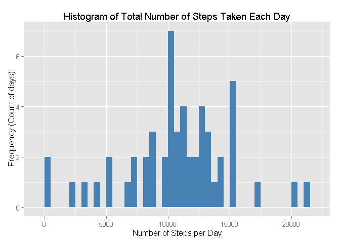
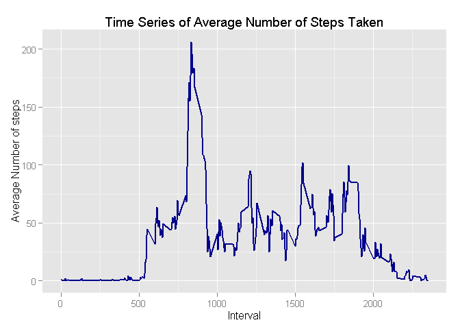
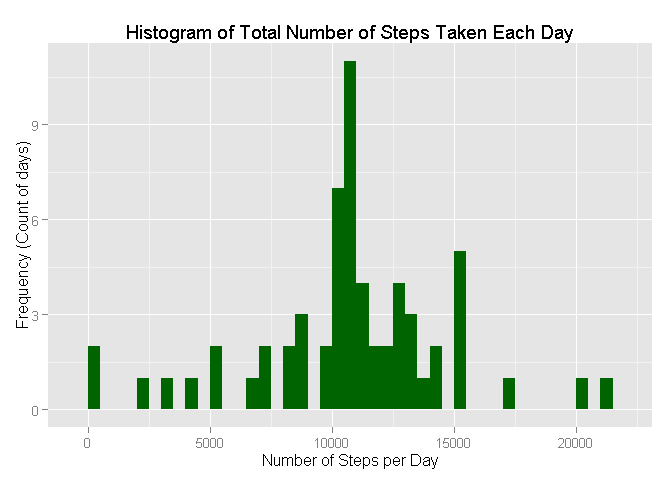
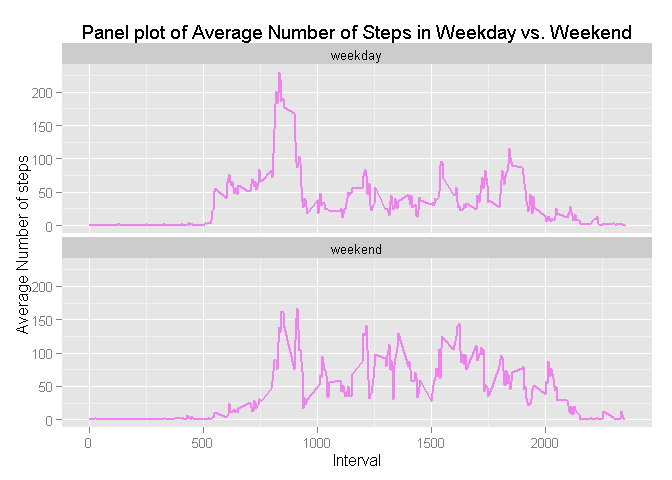

# Reproducible Research - Peer Assignment 1
Arindam Biswas  
September 19, 2015  
##Executive Summary
This assignment analyzes the data from a personal activity monitoring devices provided in `activity.csv` file. The data is collected at 5 minute intervals through out the day. The data consists of two months of data from an anonymous individuals collected during the months of `October` and `November, 2012` and include the number of steps taken in 5 minute intervals each day.

We observe that the activities on weekdays mostly follow low intensity work related routine with peak intensity activity in early morning, whereas on weekends while there is peak intensity in early morning, we observe signifcant intensity activities till evening. we find some more intensity activity in little a free time that the employ can made some sport. 

-----

##Prepare the R environment
###Step 1. Set the Global Options
This report when writing code chunks, always use `echo = TRUE` so that the report can be easily understood and reproduced.

echo is set to `TRUE` and results is set to `'hold'` as global options.  

```r
library(knitr)
opts_chunk$set(echo = TRUE, results = 'hold', fig.path='figure/')
```
###Step 2. Load the required libraries

```r
library(ggplot2)
library(lattice)
```
-----

##Data Loading and Preprocessing
###Step 1. Load the data 
Read the `activity.csv` file stored in the working directory

```r
if(!file.exists('activity.csv')){
    unzip('activity.zip')
}
actiData <- read.csv('activity.csv', header = TRUE, sep = ",",
                  colClasses=c("numeric", "character", "numeric"))
```
###Step 2. Analyze the data 
Observe the data structure and first four lines of data

```r
str(actiData)
```

```
## 'data.frame':	17568 obs. of  3 variables:
##  $ steps   : num  NA NA NA NA NA NA NA NA NA NA ...
##  $ date    : chr  "2012-10-01" "2012-10-01" "2012-10-01" "2012-10-01" ...
##  $ interval: num  0 5 10 15 20 25 30 35 40 45 ...
```

```r
head(actiData,4) 
```

```
##   steps       date interval
## 1    NA 2012-10-01        0
## 2    NA 2012-10-01        5
## 3    NA 2012-10-01       10
## 4    NA 2012-10-01       15
```
###Step 3. Transform the data 
Convert the **date** field to `Date` class and **interval** field to `Factor` class.

```r
actiData$date <- as.Date(actiData$date, format = "%Y-%m-%d")
actiData$interval <- as.factor(actiData$interval)
```

-----

## What is mean total number of steps taken per day?
###Step 1. Calculate number of steps per day
First we calculate the total number of steps taken per day

```r
steps_per_day <- aggregate(steps ~ date, actiData, sum)
colnames(steps_per_day) <- c("date","steps")
head(steps_per_day)
```

```
##         date steps
## 1 2012-10-02   126
## 2 2012-10-03 11352
## 3 2012-10-04 12116
## 4 2012-10-05 13294
## 5 2012-10-06 15420
## 6 2012-10-07 11015
```
###Step 2. Make the histogram
Now we make a histogram of the total number of steps taken per day, plotted with appropriate bin interval (`taken as 500 steps`).


```r
ggplot(steps_per_day, aes(x = steps)) + 
       geom_histogram(fill = "steelblue", binwidth = 500) + 
        labs(title="Histogram of Total Number of Steps Taken Each Day", 
             x = "Number of Steps per Day", y = "Frequency (Count of days)")
```

 

###Step 3. Calculate the Mean
Now we calculate the ***mean*** and ***median*** of the number of steps taken per day.


```r
steps_mean   <- mean(steps_per_day$steps, na.rm=TRUE)
steps_median <- median(steps_per_day$steps, na.rm=TRUE)
```

The *mean of the total number of steps taken per day* is **10766.189** and *median of the total number of steps taken per day* is **10765**.

-----

## What is the average daily activity pattern?
We analyze the average daily activity pattern by aggregating the steps by intervals of 5-minutes (denoted by `steps_per_interval`)


```r
steps_per_interval <- aggregate(actiData$steps, by = list(interval = actiData$interval),
                                mean, na.rm=TRUE)
```
Then we convert the interval as integer (`for ease of time series plotting`) 

```r
steps_per_interval$interval <- 
        as.integer(levels(steps_per_interval$interval)[steps_per_interval$interval])
colnames(steps_per_interval) <- c("interval", "steps")
```

###Step 1. Make a Time Series plot 
We make the time series plot of the 5-minute interval (x-axis) and the average number of steps taken, averaged across all days (y-axis)


```r
ggplot(steps_per_interval, aes(x=interval, y=steps)) +   
        geom_line(color="darkblue", size=1) +  
        labs(title="Time Series of Average Number of Steps Taken", x="Interval", y="Average Number of steps")
```

 

###Step 2. Find Interval with Maximum Numbers of steps
Now, we find the 5-minute interval with the containing the maximum number of steps:

```r
max_step_interval <- steps_per_interval[which.max(  
        steps_per_interval$steps),]
```

The **835<sup>th</sup>** interval has maximum **206** steps.

----

## Imputing missing values
###Step 1. Total number of missing values

First We will calculate the total number of missing values in steps using `is.na()` method to check whether the value is missing or not and then calculating the sum of the logical vector.


```r
missing_count <- sum(is.na(actiData$steps))
```
The total number of **missing values** are **2304**.

###Step 2. Strategy for filling all missing values

To fill the missing values, we choose to replace them with the mean for that 5-minute interval.

First we get the indexes with missing values

```r
missing_Indexes <- which(is.na(actiData$steps))
```

Then we get the corresponding intervals for the indexes 

```r
missing_Intervals <- actiData[missing_Indexes, 3] 
```

Then we fill the missing intervals with the mean of the corresponding five minute interval

```r
filled_steps <- sapply(missing_Intervals, function(x) { steps_per_interval[(steps_per_interval$interval==x), 2]})
```

###Step 3. Create a New Dataset
Now we create a `new_actiData` data set that is same as the original `actiData` data set 

```r
new_actiData <- actiData
```

Now we fill in the missing `steps` in the new data set 

```r
new_actiData[missing_Indexes, 'steps'] <- filled_steps
```

Now we validate the new data set by checking if there are any missing values 

```r
new_missing_count <- sum(is.na(new_actiData$steps))
```
The new filled data set has **0** missing values. Hence we have successfully imputed the missing values in the data set.

### Step 4. Make a Histogram for New total sum of steps 

Now we perform aggregation to get the new total sum of steps for each date

```r
new_steps_per_day <- aggregate(steps ~ date, new_actiData, sum)
colnames(new_steps_per_day) <- c("date","steps")
```

Now we make a histogram of the total number of steps taken per day, plotted with appropriate bin interval (`taken as 500 steps`).

```r
ggplot(new_steps_per_day, aes(x = steps)) + 
       geom_histogram(fill = "darkgreen", binwidth = 500) + 
        labs(title="Histogram of Total Number of Steps Taken Each Day", 
             x = "Number of Steps per Day", y = "Frequency (Count of days)") 
```

 

### Step 4b. Calculate the New Mean and Median
Then we calculate the new mean and median of the total number of steps taken per day

```r
new_steps_mean   <- mean(new_steps_per_day$steps)
new_steps_median <- median(new_steps_per_day$steps)
```
The *mean of the total number of steps taken per day* in the **new filled data set** is **10766.189** and *median of the total number of steps taken per day* in the **new filled data set** is **10766.189**

### Step 4c. Do these values differ from the estimates from the first part of the assignment?

While the new Mean remains unchanged the new Median value do differ slightly.

- **Mean**
    1. Original Data : **10766.189**
    2. Filled Data: **10766.189**
    
    
- **Median**
    1. Original Data  : **10765**
    2. Filled Data: **10766.189**

### Step 4d. Impact of imputing missing data

We observe that the impact of imputing missing data on the estimates of the total daily number of steps, is that after filling the data the mean value remains unchanged. 

However the median value has shifted and now is equal to the mean. 

----

## Are there differences in activity patterns between weekdays and weekends?
### Step 1. Create a new factor variable 
We create a new factor variable in the data set with two levels  - `weekday` and `weekend` indicating whether a given date is a weekday or weekend day


```r
new_actiData['day'] <- factor(sapply(new_actiData$date, function(x){ if (weekdays(x) == "Sunday" | weekdays(x) == "Saturday") { "weekend" } else { "weekday"} }))
```

Now we aggregate the number of steps for the time interval and day

```r
new_steps_per_interval <- aggregate(steps ~ interval + day, mean, data=new_actiData)
```
Then we convert the interval as integer (for ease of time series plotting 

```r
new_steps_per_interval$interval <- 
        as.integer(levels(new_steps_per_interval$interval)[new_steps_per_interval$interval])
```

### Step 2. Make a Panel plot
We make a panel plot containing a time series plot of the 5-minute interval (x-axis) and the average number of steps taken, averaged across all weekday days or weekend days (y-axis)


```r
ggplot(new_steps_per_interval, aes(x=interval, y=steps)) +   
        geom_line(color="violet", size=1) + 
              facet_wrap(~ day, nrow=2, ncol=1) +
        labs(title="Panel plot of Average Number of Steps in Weekday vs. Weekend", x="Interval", y="Average Number of steps")
```

 

We observe from the above panel plot for weekday vs. weekend days that average number of steps taken on the weekday has a highest peak value between the `750` and `1000` five minute time intervals (**Early Morning**) . This is significantly higher than the  peak in the number of steps taken on weekdays (*which also occurs between the `750` and `1000` five minute time intervals  i.e., early morning*)

We also observe that weekends have larger number of peaks for average numbers of steps over hundred as compared to that of weekday. This could be due to the fact that activities on weekdays mostly follow a work related routine with little free time in *Early Morning*, where we find some more intensity activity. In the other hand, at weekend we can see better distribution of effort along the time between the `750` and `1800` five minute time intervals (**Early Morning** till **Evening**).
